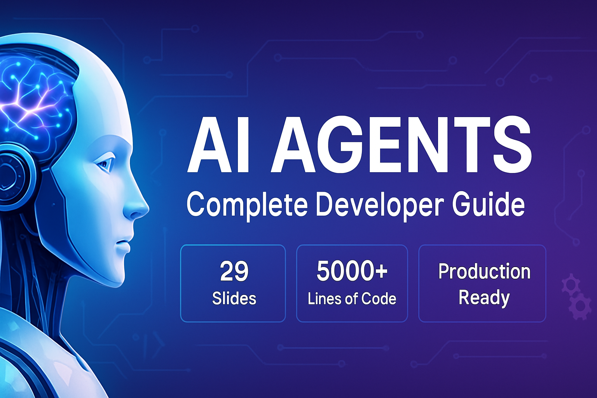

# 🤖 AI Agents: Complete Developer Guide



[](https://github.com/stretchcloud/ai-agents-presentation/stargazers)
[](https://github.com/stretchcloud/ai-agents-presentation/network/members)
[](https://opensource.org/licenses/MIT)
[](https://stretchcloud.github.io/ai-agents-presentation/)

> **A comprehensive, technical presentation covering AI agent architecture, implementation, and practical applications for software developers.**

## 🌟 Overview

This repository contains a complete **29-slide presentation** designed specifically for software developers who want to understand, implement, and deploy AI agents in production environments. The presentation covers everything from basic concepts to advanced architectural patterns and real-world deployment strategies.

### 🎯 **[View Live Demo →](https://stretchcloud.github.io/ai-agents-presentation/)**

## 📋 What's Included

### 📊 **Comprehensive Coverage**
- **29 Professional Slides** with detailed technical content
- **5000+ Lines of Code Examples** with syntax highlighting
- **Architecture Diagrams** and visual explanations
- **Real-world Implementation Patterns** and best practices
- **Production Deployment Strategies** with security considerations

### 🎨 **Professional Design**
- Modern, clean interface optimized for technical presentations
- Consistent branding and visual hierarchy
- Interactive elements and smooth animations
- Mobile-responsive design for all devices
- Professional color scheme suitable for corporate environments

## 🗂️ Repository Structure

```
ai-agents-presentation/
├── index.html                 # Main landing page with navigation
├── presentation.html          # Slide navigation interface
├── slides/                    # All 29 presentation slides
│   ├── title_slide.html
│   ├── agenda_objectives.html
│   ├── what_are_agents.html
│   ├── evolution_traditional_ai.html
│   ├── why_agents_matter.html
│   ├── agent_vs_assistant_chatbot.html
│   ├── five_agent_types_overview.html
│   ├── reflex_agents.html
│   ├── goal_utility_agents.html
│   ├── learning_agents.html
│   ├── multi_agent_systems.html
│   ├── core_architecture.html
│   ├── react_architecture.html
│   ├── tool_calling.html
│   ├── memory_systems.html
│   ├── planning_reasoning.html
│   ├── feedback_learning.html
│   ├── framework_landscape.html
│   ├── langchain_langgraph.html
│   ├── autogen_crewai.html
│   ├── emerging_frameworks.html
│   ├── software_dev_applications.html
│   ├── enterprise_applications.html
│   ├── industry_implementations.html
│   ├── performance_roi.html
│   ├── design_patterns.html
│   ├── testing_debugging.html
│   ├── deployment_production.html
│   └── future_outlook.html
├── docs/                      # Additional documentation
├── assets/                    # Images and resources
├── screenshots/               # Preview images
└── README.md                  # This file
```

## 📚 Presentation Sections

### 🔹 **1. Introduction & Foundations** (Slides 1-6)
- Core AI agent definitions and characteristics
- Evolution from traditional AI approaches
- Technical distinctions between agents, assistants, and chatbots
- Impact on developer workflows and productivity

### 🔹 **2. Agent Types & Classification** (Slides 7-11)
- Five types of AI agents with complexity spectrum
- Simple reflex and model-based reflex agents
- Goal-based and utility-based agents
- Learning agents with ML integration
- Multi-agent systems and coordination patterns

### 🔹 **3. Technical Architecture** (Slides 12-17)
- Core agent architecture components
- ReAct (Reasoning + Acting) pattern implementation
- Tool calling and external integration strategies
- Memory systems and state management
- Planning and reasoning engines
- Feedback and learning mechanisms

### 🔹 **4. Frameworks & Tools** (Slides 18-21)
- Comprehensive framework landscape overview
- LangChain and LangGraph deep dive
- AutoGen and CrewAI comparison
- OpenAI Swarm and emerging frameworks

### 🔹 **5. Real-World Applications** (Slides 22-25)
- AI agents in software development workflows
- Enterprise applications and business process automation
- Industry-specific implementations
- Performance metrics and ROI analysis

### 🔹 **6. Implementation Best Practices** (Slides 26-28)
- Design patterns and architecture principles
- Testing and debugging strategies
- Deployment and production considerations

### 🔹 **7. Future Outlook** (Slide 29)
- Emerging trends and technology roadmap
- Learning path for developers
- Next steps and resources

## 🚀 Quick Start

### Option 1: View Online
Simply visit the **[Live Demo](https://stretchcloud.github.io/ai-agents-presentation/)** to access the complete presentation immediately.

### Option 2: Run Locally

1. **Clone the repository:**
   ```bash
   git clone https://github.com/yourusername/ai-agents-presentation.git
   cd ai-agents-presentation
   ```

2. **Start a local server:**
   ```bash
   # Using Python
   python -m http.server 8000
   
   # Using Node.js
   npx serve .
   
   # Using PHP
   php -S localhost:8000
   ```

3. **Open in browser:**
   ```
   http://localhost:8000
   ```

### Option 3: GitHub Pages
This repository is configured for GitHub Pages deployment. Simply enable GitHub Pages in your repository settings to get a permanent URL.

## 💻 Technical Features

### **Code Examples**
- **Production-ready implementations** with error handling
- **Multiple programming languages** (Python, JavaScript, TypeScript)
- **Framework-specific examples** (LangChain, AutoGen, CrewAI)
- **Deployment configurations** (Docker, Kubernetes, cloud platforms)

### **Architecture Patterns**
- **ReAct (Reasoning + Acting)** implementation patterns
- **Multi-agent coordination** strategies
- **Memory management** and state persistence
- **Tool integration** and API calling patterns

### **Best Practices**
- **Security considerations** for production deployment
- **Performance optimization** techniques
- **Monitoring and observability** strategies
- **Testing frameworks** for agent behavior validation

## 🎓 Learning Outcomes

After going through this presentation, developers will be able to:

- ✅ **Understand** core AI agent concepts and architectures
- ✅ **Implement** ReAct patterns and tool calling mechanisms
- ✅ **Choose** appropriate frameworks for specific use cases
- ✅ **Design** scalable multi-agent systems
- ✅ **Deploy** agents in production environments
- ✅ **Monitor** and optimize agent performance
- ✅ **Apply** security best practices and compliance requirements

## 🛠️ Technologies Used

- **Frontend:** HTML5, CSS3 (Tailwind CSS), JavaScript (ES6+)
- **Styling:** Tailwind CSS, Font Awesome icons
- **Code Highlighting:** Prism.js
- **Charts:** Chart.js, D3.js
- **Deployment:** Static hosting (GitHub Pages compatible)

## 📖 Usage Guidelines

### **For Educators**
- Use as course material for AI/ML classes
- Adapt slides for specific learning objectives
- Include in computer science curricula

### **For Developers**
- Reference implementation patterns
- Use code examples as starting points
- Follow architectural guidelines for projects

### **For Organizations**
- Training material for development teams
- Technical decision-making reference
- Architecture planning and design

## 🤝 Contributing

We welcome contributions to improve this presentation! Here's how you can help:

### **Ways to Contribute**
- 🐛 **Report bugs** or issues with slides
- 💡 **Suggest improvements** to content or design
- 📝 **Add new examples** or use cases
- 🔧 **Fix technical issues** or typos
- 🌟 **Share feedback** on presentation effectiveness

### **Contribution Process**
1. Fork the repository
2. Create a feature branch (`git checkout -b feature/amazing-feature`)
3. Make your changes
4. Test thoroughly
5. Commit your changes (`git commit -m 'Add amazing feature'`)
6. Push to the branch (`git push origin feature/amazing-feature`)
7. Open a Pull Request

### **Development Setup**
```bash
# Clone your fork
git clone https://github.com/stretchcloud/ai-agents-presentation.git
cd ai-agents-presentation

# Create a new branch
git checkout -b feature/your-feature-name

# Make changes and test locally
python -m http.server 8000

# Commit and push
git add .
git commit -m "Your descriptive commit message"
git push origin feature/your-feature-name
```

## 📄 License

This project is licensed under the MIT License - see the [LICENSE](LICENSE) file for details.

## 🙏 Acknowledgments

- **AI Research Community** for foundational concepts and patterns
- **Open Source Frameworks** (LangChain, AutoGen, CrewAI) for implementation examples
- **Developer Community** for feedback and contributions
- **Educational Institutions** using this material for teaching

## 📞 Contact & Support

- **Issues:** [GitHub Issues](https://github.com/yourusername/ai-agents-presentation/issues)
- **Discussions:** [GitHub Discussions](https://github.com/yourusername/ai-agents-presentation/discussions)
- **Twitter:** [@stretchcloud](https://twitter.com/stretchcloud)

## 🌟 Show Your Support

If this presentation helped you learn about AI agents, please consider:

- ⭐ **Starring this repository**
- 🍴 **Forking for your own use**
- 📢 **Sharing with your network**
- 💬 **Providing feedback**

---

<div align="center">

**[🚀 View Live Demo](https://stretchcloud.github.io/ai-agents-presentation/)** | **[📖 Browse Slides](slides/)** | **[🤝 Contribute](CONTRIBUTING.md)**

Made with ❤️ for the developer community

</div>

